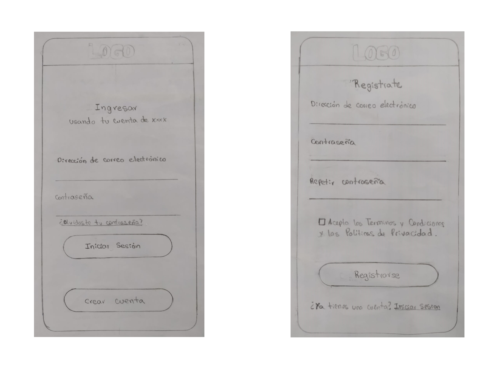

# &lt;/CoderPlace&&gt;

Es una red social dirigida a Programadores de todo el mundo, donde podrán compartir herramientas, tips, consejos de buenas prácticas, ayuda para errores de código, nuevas tecnologías y lenguajes de programación así como interactuar entre ellos y hacer networking.

### Objetivos de aprendizajes pendientes

### UX
- [x] Planear y ejecutar _tests_ de usabilidad.

### Javascript

- [ ] Entender la diferencia entre expression y statements.
- [ ] Entender la diferencia entre tipos de datos atómicos y estructurados.

## Objetivos de aprendizaje

### HTML y CSS

* [ ] [HTML semántico](https://developer.mozilla.org/en-US/docs/Glossary/Semantics#Semantics_in_HTML)
* [ ] [CSS `flexbox`](https://css-tricks.com/snippets/css/a-guide-to-flexbox/)
* [ ] Construir tu aplicación respetando el diseño realizado (maquetación).

### DOM y Web APIs

* [ ] [Manipulación dinámica del DOM](https://developer.mozilla.org/es/docs/Referencia_DOM_de_Gecko/Introducci%C3%B3n)
* [ ] [History API](https://developer.mozilla.org/es/docs/DOM/Manipulando_el_historial_del_navegador)
* [ ] [`localStorage`]

### Javascript

* [ ] [Uso de callbacks](https://developer.mozilla.org/es/docs/Glossary/Callback_function)
* [ ] [Consumo de Promesas](https://scotch.io/tutorials/javascript-promises-for-dummies#toc-consuming-promises)
* [ ] Uso ES modules
([`import`](https://developer.mozilla.org/en-US/docs/Web/JavaScript/Reference/Statements/import)
| [`export`](https://developer.mozilla.org/en-US/docs/Web/JavaScript/Reference/Statements/export))

### Firebase

* [ ] [Firestore](https://firebase.google.com/docs/firestore)
* [ ] [Firebase Auth](https://firebase.google.com/docs/auth/web/start)
* [ ] [Firebase security rules](https://firebase.google.com/docs/rules)
* [ ] [Uso de onSnapshot](https://firebase.google.com/docs/firestore/query-data/listen)
| [onAuthStateChanged](https://firebase.google.com/docs/auth/web/start#set_an_authentication_state_observer_and_get_user_data)

### Testing

* [ ] [Testeo de tus funciones](https://jestjs.io/docs/es-ES/getting-started)
* [ ] [Testeo asíncrono](https://jestjs.io/docs/es-ES/asynchronous)
* [ ] [Mocking](https://jestjs.io/docs/es-ES/manual-mocks)

### Colaboración en Github

* [ ] Branches
* [ ] Pull Requests
* [ ] Tags

### Organización en Github

* [ ] Projects
* [ ] Issues
* [ ] Labels
* [ ] Milestones

### Buenas prácticas de desarrollo

* [ ] Modularización
* [ ] Nomenclatura / Semántica
* [ ] Linting