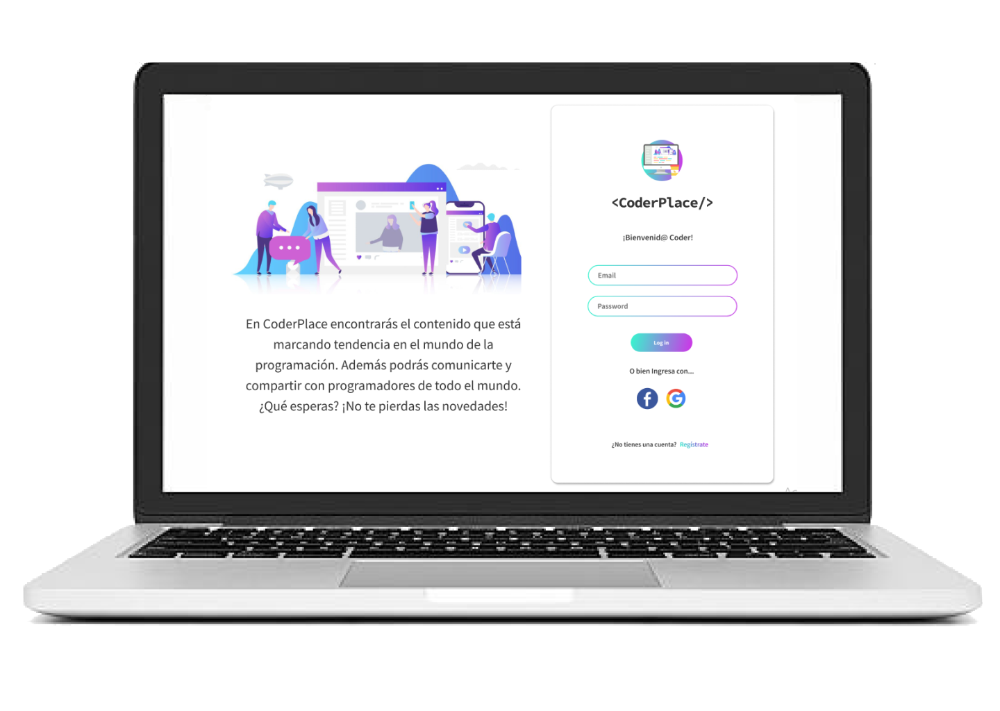
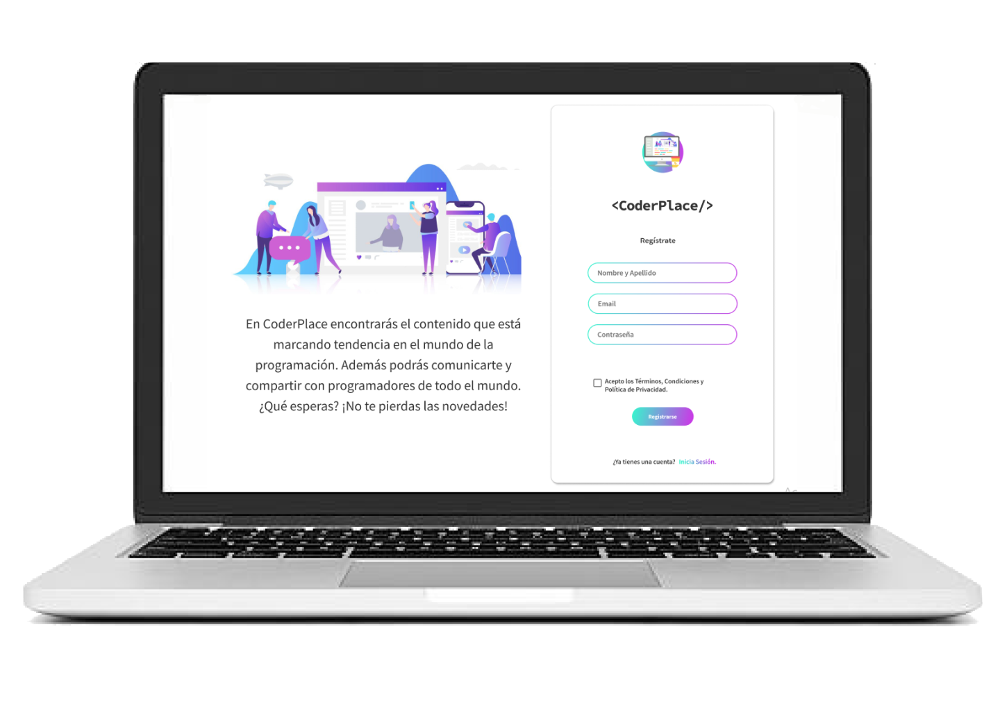
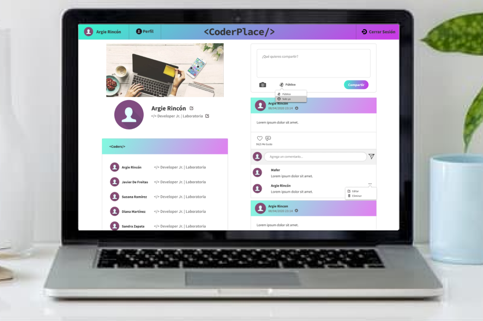

# &lt;/CoderPlace&gt;

Es una red social dirigida a Programadores de todo el mundo, donde podrán compartir herramientas, tips, consejos de buenas prácticas, ayuda para errores de código, nuevas tecnologías y lenguajes de programación; así como interactuar entre ellos y fomentar el networking estratégico.

Inicialmente éste era el prototipo de baja fidelidad para las vistas de registro e inicio de sesión.

Luego trabajamos en los prototipos de alta fidelidad de las diferentes visats:

### Mobile

### Desktop

Siguiendo los estándares de otras RRSS en este proyecto trabajamos en 6 HU que consideramos que le agregan valor a los que interactúen con nuestro producto.

Las primeras HU en las que trabajamos fueron las de Crear cuenta e Iniciar sesión con esa cuenta, utilizando el servicio de firebase para programar la autenticación del usuario. Y luego utilizamos los métodos de inicio de sesión con Google y Facebook para la el inicio de sesión con estas herramientas.

Desplegamos el proyecto una vez concluidas las funciones que le permiten al usuario compartir un post con texto e imagen o solo texto, poder editarlo o eliminarlo por completo. Para lo que utilizamos Firestore y el Cloud Storage.

Además tiene la posibilidad de configurar la privacidad del post que vaya a realizar a Público o Solo yo, así como añadir comentaraios, editarlos o eliminarlos.
También podrá añadir o remover likes a las publicaciones y modificar sus datos en el perfil.

## Objetivos de aprendizajes pendientes

### UX
- [x] Planear y ejecutar _tests_ de usabilidad.

### Javascript

- [x] Entender la diferencia entre expression y statements.

#### Expression
 Las expresiones devuelven un valor.
 Asignarle el valor a una variable.

 #### Statements
 Realizan una acción.
 Instrucciones clásicas, if, for, switch, while.

- [x] Entender la diferencia entre tipos de datos atómicos y estructurados.

#### Datos atómicos
String, número, booleano, float.

#### Datos estructurados
Arrays y objetos.

## Objetivos de aprendizaje del Proyecto

### HTML y CSS

* [x] [HTML semántico](https://developer.mozilla.org/en-US/docs/Glossary/Semantics#Semantics_in_HTML)
* [x] [CSS `flexbox`](https://css-tricks.com/snippets/css/a-guide-to-flexbox/)
* [x] Construir tu aplicación respetando el diseño realizado (maquetación).

### DOM y Web APIs

* [x] [Manipulación dinámica del DOM](https://developer.mozilla.org/es/docs/Referencia_DOM_de_Gecko/Introducci%C3%B3n)
* [x] [History API](https://developer.mozilla.org/es/docs/DOM/Manipulando_el_historial_del_navegador)
* [x] [`localStorage`]

### Javascript

* [x] [Uso de callbacks](https://developer.mozilla.org/es/docs/Glossary/Callback_function)
* [x] [Consumo de Promesas](https://scotch.io/tutorials/javascript-promises-for-dummies#toc-consuming-promises)
* [x] Uso ES modules
([`import`](https://developer.mozilla.org/en-US/docs/Web/JavaScript/Reference/Statements/import)
| [`export`](https://developer.mozilla.org/en-US/docs/Web/JavaScript/Reference/Statements/export))

### Firebase

* [x] [Firestore](https://firebase.google.com/docs/firestore)
* [x] [Firebase Auth](https://firebase.google.com/docs/auth/web/start)
* [x] [Firebase security rules](https://firebase.google.com/docs/rules)
* [x] [Uso de onSnapshot](https://firebase.google.com/docs/firestore/query-data/listen)
| [onAuthStateChanged](https://firebase.google.com/docs/auth/web/start#set_an_authentication_state_observer_and_get_user_data)

### Testing

* [ ] [Testeo de tus funciones](https://jestjs.io/docs/es-ES/getting-started)
* [ ] [Testeo asíncrono](https://jestjs.io/docs/es-ES/asynchronous)
* [ ] [Mocking](https://jestjs.io/docs/es-ES/manual-mocks)

### Colaboración en Github

* [x] Branches
* [x] Pull Requests
* [x] Tags

### Organización en Github

* [ ] Projects
* [ ] Issues
* [ ] Labels
* [ ] Milestones

### Buenas prácticas de desarrollo

* [x] Modularización
* [x] Nomenclatura / Semántica
* [ ] Linting